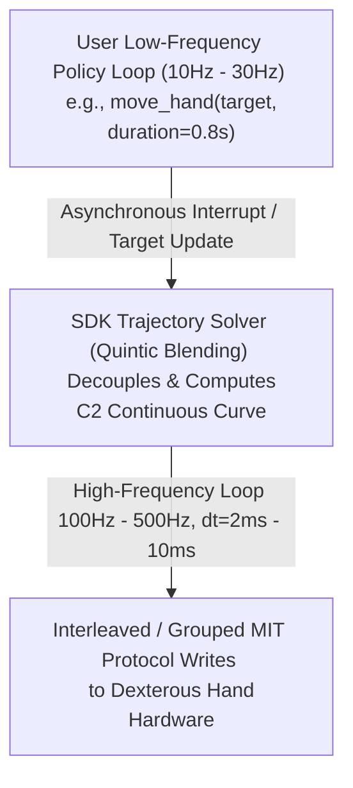

# Revo3 Motor API Reference

21 DoF Dexterous Hand with 21 Motors

> **Note:** All APIs use the Revo3 protocol with **joint-based** addressing (21 joints).
> All speed/velocity parameters use **RPM** (`1 RPM = 6 °/s`).

## Table of Contents
1. [Control Modes](#control-modes)
2. [Single / Multi Joint Control](#single--multi-joint-control)
3. [MIT Control (Impedance / Force-Position Hybrid)](#mit-control-impedance--force-position-hybrid)
4. [High-Frequency Real-Time Servo Control (Servo APIs)](#high-frequency-real-time-servo-control-servo-apis)
5. [High-Level Motion Control (Trajectory & Teaching)](#high-level-motion-control-trajectory--teaching)
6. [Status Read](#status-read)
7. [System Info](#system-info)
8. [Calibration & Config](#calibration--config)
9. [Motor Status Code (Bitmask)](#motor-status-code-bitmask)
10. [Register Map](#register-map)

## Control Modes

| Value | Mode | Parameter | Description |
|:-----:|------|-----------|-------------|
| 0 | Position | Target angle (deg) | Pure position control |
| 1 | Speed | Target velocity (rpm) | Pure velocity control |
| 2 | Current | Target current (mA) | Pure torque/current control |
| 4 | Impedance | Impedance coefficient (Kp) | Position stiffness — simplified MIT |
| 5 | Damping | Damping coefficient (Kd) | Velocity damping — simplified MIT |

### Data Conversion Rules

> **Important SDK Note:** The Revo3 SDK handles all `x100` encoding/decoding automatically. You should **always pass direct physical float values** (`f32` in Rust/C++, `float` in Python) to the SDK APIs (e.g., passing `150.5` degrees, `50.0` RPM). The table below documents the internal Modbus/CAN protocol encoding, not the SDK API interface.

| Parameter | Conversion | Register Type |
|-----------|-----------|---------------|
| Position, Velocity | `value × 100` → i16 | X100 scaling |
| Kp, Kd | `value × 100` → u16 | X100 scaling |
| Current / Torque | Direct mA → i16 | No scaling |
| Temperature | Direct °C → u16 | No scaling |

## Single / Multi Joint Control

| API | Description | Registers |
|-----|-------------|-----------|
| `revo3_single_joint_control(slave_id, joint_id, mode, param)` | Single joint control | 1000~1002 |
| `revo3_multi_joint_control(slave_id, mode, params[21])` | Multi-joint synchronous control | 1010~1031 |

## MIT Control (Impedance / Force-Position Hybrid)

```
τ = Kp * (pos_ref − pos_actual) + Kd * (vel_ref − vel_actual) + τ_ff
```

| Term | Symbol | Meaning | Typical Range |
|------|--------|---------|---------------|
| Position stiffness | `Kp` | Spring-like force toward target position | 0.0 ~ 10.0 |
| Velocity damping | `Kd` | Damper-like resistance to speed deviation | 0.0 ~ 10.0 |
| Target position | `pos_ref` | Desired angle | ±434.7° |
| Target velocity | `vel_ref` | Desired angular velocity | ±32767 rpm |
| Feedforward torque | `τ_ff` | Direct force (gravity compensation, etc.) | ±1024 mA |

**Recommended MIT Usage:**
- Speed control: set `Kp=0`, use `Kd` with target `vel_ref`, and keep `τ_ff=0`.
- Position control: use `Kp` and `Kd`, set `vel_ref=0`, and keep `τ_ff=0`.
- Current control: set `Kp=0` and `Kd=0`, then use `τ_ff` as target current.

**Relationship to Control Modes:**
- Mode 4 (Impedance) ≈ MIT with only Kp active
- Mode 5 (Damping) ≈ MIT with only Kd active
- Full MIT = complete Kp + Kd + pos_ref + vel_ref + τ_ff control

> **Understanding `τ_ff` (Feedforward Torque):**
> In advanced robotics (e.g., quadruped legs, robotic arms), `τ_ff` is used for **Gravity Compensation** (outputting a constant force against gravity so the joint feels "weightless" while maintaining 0 positional error) and **Dynamic/Inertial Feedforward** (providing pre-calculated F=m*a force to eliminate phase lag during high-speed trajectory tracking).
> 
> **For the Revo3 Dexterous Hand:** Given the extremely light mass of the finger linkages and the transmission characteristics, complex dynamic heavy-lifting or gravity compensation is rarely required. Consequently, `τ_ff` is typically maintained at `0`, and the control relies on the `Kp` and `Kd` error-driven terms to provide a compliant, elastic impedance response.

| API | Description | Registers |
|-----|-------------|-----------|
| `revo3_joint_mit_control(slave_id, joint_id, kp, kd, pos, vel, torque)` | Single joint MIT | 1050~1055 |
| `revo3_set_joint_mit_params(slave_id, joint_id, kp, kd, pos, vel, torque)` | Set one joint in the interleaved MIT params block | 1100+N×5 |
| `revo3_hand_mit_control(slave_id, kp[21], kd[21], pos[21], vel[21], tor[21])` | Full-hand MIT control, interleaved by joint | 1100~1204 (105) |

### Grouped MIT Parameter Control

| API | Description | Registers |
|-----|-------------|-----------|
| `revo3_set_all_mit_kp(slave_id, kp[21])` | Grouped Kp params | 1300~1320 |
| `revo3_set_all_mit_kd(slave_id, kd[21])` | Grouped Kd params | 1321~1341 |
| `revo3_set_all_mit_positions(slave_id, pos[21])` | Grouped position params | 1342~1362 |
| `revo3_set_all_mit_velocities(slave_id, vel[21])` | Grouped velocity params | 1363~1383 |
| `revo3_set_all_mit_torques(slave_id, tor[21])` | Grouped torque params (mA) | 1384~1404 |
| `revo3_set_all_mit_params(slave_id, kp, kd, pos, vel, tor)` | All 5 params grouped | 1300~1404 (105) |

> **Interleaved hand control (1100~1204) vs grouped params (1300~1404):**
> - `revo3_hand_mit_control`: data **interleaved** per joint — `[j0_kp, j0_kd, j0_pos, j0_vel, j0_tor, j1_kp, ...]`
> - `revo3_set_all_mit_params`: data **grouped** by parameter — `[kp×21, kd×21, pos×21, vel×21, tor×21]`
> 
> **Note on High-Frequency Control (`without_retry`):**
> By default, the SDK uses robust write commands that automatically retry on timeout/failure. 
> For **real-time control loops** (e.g. trajectories, teleoperation, VR mapping) where blocking on a dropped packet causes jitter, you should use the `_without_retry` variants: 
> `revo3_hand_mit_control_without_retry` and `revo3_set_all_mit_params_without_retry`.

### Finger-Level Control

| API | Description | Registers |
|-----|-------------|-----------|
| `revo3_finger_control(slave_id, finger_id, mode, params[4])` | Non-thumb finger (4 joints: Abd, MCP, PIP, DIP) | 1500~1505 |
| `revo3_thumb_control(slave_id, mode, params[5])` | Thumb (5 joints: CMC_rotation, MCP, IP, CMC_abd, CMC_flex) | 1510~1515 |
| `revo3_finger_mit_control(slave_id, finger_id, params[20])` | Finger MIT (4 joints × 5 params) | 1520~1540 |
| `revo3_thumb_mit_control(slave_id, params[25])` | Thumb MIT (5 joints × 5 params) | 1550~1574 |

**finger_id**: 1=Index, 2=Middle, 3=Ring, 4=Pinky (NOT 0-based for non-thumb)

### Protection & Configuration

| API | Description | Registers |
|-----|-------------|-----------|
| `revo3_set_global_protect_current(slave_id, mA)` | Global protection current | 200 |
| `revo3_set_joint_protect_current(slave_id, joint_id, mA)` | Per-joint protection current | 201~221 |
| `revo3_set_joint_position_limits(slave_id, joint_id, min, max)` | Joint position limits | 240~290 |
| `revo3_set_joint_speed_limits(slave_id, joint_id, min, max)` | Joint speed limits | 300~341 |
| `revo3_reset_finger_defaults(slave_id, finger_id)` | Reset finger to factory defaults | — |

---

## High-Frequency Real-Time Servo Control (Servo APIs)

For high-frequency, real-time closed-loop control applications (e.g., 100Hz - 500Hz haptic teleoperation, VR glove mapping, or compliance controllers), conventional trajectory planning and standard blocking Modbus commands cause command starvation and mechanical jitter.

The SDK introduces a dedicated **Servo Control Suite** that features:
- **Zero-Retry, Single-Write Architecture:** Executes single Modbus/CANFD writes and returns immediately without blocking thread progression or retrying.
- **Built-in First-Order Low-Pass Filter (LPF):** Automatically filters incoming high-frequency positional commands locally on the host to ensure smooth mechanical transitions and reduce current spikes.
- **Second-Order Critically Damped System Simulator:** Numerical physics simulation of a mass-spring-damper system, guaranteeing both position and velocity continuity with absolutely zero overshoot even under step targets.
- **Auto Filter State Warm-Up:** Automatically warms the filter's history cache using current actual joint positions upon receiving the first command to prevent severe zero-drop jumps.

### Servo APIs

| API | Description | Typical Application |
|-----|-------------|---------------------|
| `revo3_set_servo_lpf_alpha(alpha)` | Sets first-order LPF factor alpha in (0.0, 1.0]. Default is `1.0` (filtering disabled). | Set to e.g. `0.2` to smooth jagged input trajectories (deprecated for mode-based API). |
| `revo3_get_servo_lpf_alpha()` | Gets current LPF alpha factor. | Debugging current smoothing. |
| `revo3_set_servo_filter_mode(mode)` | Sets servo smoothing filter mode: `0` = None, `1` = FirstOrderLpf, `2` = SecondOrderCriticallyDamped. Default is `0`. | Select `2` for advanced physics-based smooth tracking. |
| `revo3_get_servo_filter_mode()` | Gets current servo filter mode. | Verification of active filter configurations. |
| `revo3_set_servo_damping_omega(omega)` | Sets second-order filter natural frequency omega_n (rad/s). Higher values mean faster tracking but less smoothing. Default is `20.0`. | Tune for physical responsiveness. |
| `revo3_get_servo_damping_omega()` | Gets current natural frequency omega_n. | Debugging damping parameters. |
| `revo3_servo_joint(slave_id, joint_id, pos, vel)` | Servos single joint using default gains. Automatically preempts any active background trajectories. | Single finger real-time mapping. |
| `revo3_servo_joint_with_gains(..., kp, kd)` | Servos single joint using custom gains. Automatically preempts any active background trajectories. | Interactive compliance tuning. |
| `revo3_servo_hand(slave_id, positions[21], velocities[21])` | Servos all 21 joints simultaneously using default gains. Automatically preempts active background trajectories. | Full-hand VR glove tracking. |
| `revo3_servo_hand_with_gains(..., kp, kd)` | Servos all 21 joints simultaneously using custom gains. Automatically preempts active background trajectories. | Dynamic impedance/admittance loops. |
| `revo3_servo_finger(slave_id, finger_id, pos[4], vel[4])` | Servos non-thumb finger using default gains. Automatically preempts background trajectories. | High-frequency teleoperation of individual fingers. |
| `revo3_servo_finger_with_gains(..., kp[4], kd[4])` | Servos non-thumb finger using custom gains. Automatically preempts background trajectories. | High-frequency compliant single finger tasks. |
| `revo3_servo_thumb(slave_id, pos[5], vel[5])` | Servos thumb using default gains (5 joints). Automatically preempts background trajectories. | High-frequency thumb tracking. |
| `revo3_servo_thumb_with_gains(..., kp[5], kd[5])` | Servos thumb using custom gains. Automatically preempts background trajectories. | Advanced compliant thumb tasks. |
| `revo3_start_servo_drag(slave_id, joint_id, target_pos, kp, kd, vel_cap_rpm, interval_ms, idle_timeout_ms, filter_mode, omega)` | Starts one SDK-managed background stream for GUI-style target dragging. | Slider press, joystick engage, VR target stream start. |
| `revo3_update_servo_drag(slave_id, joint_id, target_pos)` | Updates the latest target for an active servo-drag stream. Does not direct-read actual position. | Slider valueChanged / joystick target refresh. |
| `revo3_stop_servo_drag(slave_id, joint_id, final_pos)` | Stops servo-drag and sends one zero-velocity hold at `final_pos`. | Slider release, leaving position mode, cleanup. |

### Servo Drag Helper

`servo_drag` is a convenience layer over `servo_joint_with_gains` for event-driven UI control. Instead of making Python/C++ maintain its own 10 ms loop, the SDK runs one background worker, keeps only the latest target, and writes position-mode MIT commands at `interval_ms`. The MIT velocity term is kept at zero; position tracking is controlled by `kp`, `kd`, and the latest target.

Recommended Modbus GUI starting values:

| Parameter | Typical Value | Notes |
|-----------|---------------|-------|
| `kp` | `2.0` | Position stiffness. Lower values feel more compliant; higher values track harder. |
| `kd` | `0.25` | Damping. Increase slightly if actual position overshoots or oscillates. |
| `vel_cap_rpm` | `40.0 ~ 60.0` | Reserved for future velocity feed-forward experiments. Current position-mode drag keeps target velocity at zero. |
| `interval_ms` | `15` | A conservative GUI value when DataCollector is also running on Modbus. Use smaller values only when bus load is acceptable. |
| `idle_timeout_ms` | `300` | Refresh interval for an unchanged target. It does not stop the stream while the slider/joystick is still held. Use `revo3_stop_servo_drag` to end the stream. |
| `filter_mode` | `0` | No SDK-side smoothing. This is the preferred GUI default when slider updates are already rate-limited. Use `2` only if the input target is noisy. |
| `omega` | `35.0` | Used only when `filter_mode=2`. Higher means faster tracking but less smoothing. |

`servo_drag` can coexist with DataCollector because both use the shared SDK context lock, but they still share the same physical serial/CAN bus. On macOS Modbus, start with motor collection around 50 Hz to 60 Hz, and reduce it to 5 Hz to 10 Hz while a slider/joystick drag is active. Control writes should have priority over idle status reads; the SDK collector skips a poll when the device context is busy instead of queuing behind control commands. If actual tracking still lags, increase `interval_ms` or tune `kp`/`kd`.

### Which Control API Should I Use?

| Scenario | Recommended API | Why |
|----------|-----------------|-----|
| One-shot posture change, scripted sequence, vision/RL command at 10 Hz - 30 Hz | `revo3_move_*` | SDK plans a smooth quintic trajectory and handles mid-course blending. |
| GUI slider, joystick, VR controller target that changes only on user input | `revo3_start_servo_drag` + `revo3_update_servo_drag` + `revo3_stop_servo_drag` | SDK owns the background stream and avoids Python/C++ loop jitter. |
| Custom real-time controller that already runs its own deterministic loop | `revo3_servo_joint_with_gains`, `revo3_servo_hand_with_gains`, finger/thumb servo APIs | Caller owns timing, filtering, and target generation. |
| Low-level register-style position/speed/current command | `revo3_single_joint_control`, `revo3_multi_joint_control` | Direct control-mode writes for simple static commands. |

Use `move_*` when you know the target and want the SDK to generate the path. Use `servo_drag` when the target itself is being dragged interactively. Use single-call servo APIs when another controller already produces every servo tick.

### Core Differences: Servo (MIT) Mode vs. Pure Position Control

Understanding the physics and control loops is essential when choosing between raw positional writes and the high-frequency Servo suite.

| Metric | Pure Position Control (Mode 0) | Servo Control (MIT Mode / Mode 4 & 5) |
|---|---|---|
| **Underlying Formula** | `Torque = PID(Target_Pos - Actual_Pos)` executed inside motor driver firmware. | `Torque = Kp * (pos_ref - pos_actual) + Kd * (vel_ref - vel_actual) + torque_ff` |
| **Stiffness Control** | **Rigid/Solid:** Controller gains (PID) are pre-configured in firmware and cannot be dynamically adjusted. | **Compliant/Adjustable:** Positional stiffness `Kp` and damping `Kd` can be dynamically altered on every single packet. |
| **Obstacle Interaction** | **Rigid Resistance:** Hand outputs maximum current to overpower obstacles, risking motor overheating or crushing fragile items. | **Compliance & Safety:** Lowering `Kp` behaves like an elastic torsion spring. Hands deform gently around obstacles and spring back when released. |
| **Noise Filtering** | **Vulnerable:** High-frequency noise from sensors (e.g. data gloves) translates directly to harsh motor jitter and current spikes. | **Robust:** Local host-side LPF and Second-Order Mass-Spring-Damper simulation ensure double-continuous trajectories. |
| **Communication Jitter** | **High:** Under default robust writes, occasional packet drops trigger blocking retries, causing mechanical stutter. | **Zero:** Built on **Zero-Retry, Single-Write** topology. High frequency (e.g. 100Hz+) naturally resolves transient loss. |

#### Guidance for Selecting Control Primitives

1. **Use Pure Position Control** when performing low-frequency, static posture changes in environments completely free of obstacles (e.g. hand calibration, opening hand to maximum limits).
2. **Use Servo (MIT) Control** for real-time tracking loops, physical compliance, haptic teleoperation, and active force-impedance tasks. By reducing `Kp` to a lower range (e.g., `0.5 ~ 1.5`), you can implement passive compliance that grips complex, delicate geometries without crushing them, providing exceptional safety and mechanical longevity.

## High-Level Motion Control (Trajectory & Teaching)


The SDK provides high-level motion primitives that perform smooth trajectory interpolation and manual guidance (drag-teaching) on the host side. These APIs do not directly map to single hardware registers but internally manage high-frequency control loops using the underlying MIT protocol.

### Why High-Level Motion Control is Optimized for Low-Frequency / Non-Real-Time Decision Loops

In practical robotic tasks (e.g., high-level RL policy planning, vision-guided grasping, or state-machine behavior execution), the user's decision-making loop typically runs at a **low frequency (e.g., 10Hz to 30Hz)** or is event-driven (single point-to-point command trigger). Directly streaming raw positional targets to the hand at low rates creates massive mechanical steps and joint jitter.

The High-Level Motion Control suite perfectly addresses this by decoupling the **low-frequency user decision loop** from the **high-frequency motor control loop**:



| Dimension | High-Frequency Real-Time Servo (Servo APIs) | High-Level Motion Control (Trajectory APIs) |
| :--- | :--- | :--- |
| **Control Frequency** | High-frequency streaming (**100Hz - 500Hz**) | Low-frequency / non-real-time (**10Hz - 30Hz** or event-driven) |
| **Decoupling Layer** | None. User must manually handle trajectory smoothing. | Fully managed by the SDK host-side runner thread. |
| **Command Interruption** | Step targets cause physical shocks unless filtered by LPF/Second-order model. | Smoothly resolved mid-course via dynamic **Quintic Blending**. |
| **Typical Use Cases** | Haptic teleoperation, VR glove tracking, real-time closed-loop admittance. | Vision-based grasping pipelines, pick-and-place, sequence-based tasks. |

### Trajectory Control (Quintic Polynomial & Quintic Blending)

Moves joints smoothly over a specified duration with automatic support for **Quintic Blending**. Under the hood, the trajectory solver calculates a 5th-order polynomial trajectory supporting arbitrary non-zero initial boundary conditions (initial velocity v0 and initial acceleration a0) and smoothly decelerates to zero velocity and acceleration at the target. This ensures perfectly smooth transitions during dynamic mid-course re-planning or target interruptions without physical shocks.

Planner diagnostics may report internal velocity in degrees per second, for example `blend would violate limits (v0=-377.5°/s)`. Public SDK speed parameters and firmware speed limits remain rpm; the SDK converts between `°/s` and rpm using `1 rpm = 6 °/s` before writing to firmware.

| API | Description | Default Gains |
|-----|-------------|---------------|
| `revo3_move_joint(slave_id, joint_id, target_pos, duration, dt)` | Move a single joint to target position (Non-blocking in Rust/Python) | Kp=1.0, Kd=0.1 |
| `revo3_move_joint_wait(slave_id, joint_id, target_pos, duration, dt)` | Move a single joint and block until completion | Kp=1.0, Kd=0.1 |
| `revo3_move_joint_with_gains(slave_id, joint_id, target_pos, duration, dt, kp, kd)` | Move a single joint with custom gains (Non-blocking in Rust/Python) | Custom |
| `revo3_move_joint_with_gains_wait(slave_id, joint_id, target_pos, duration, dt, kp, kd)` | Move a single joint and block with custom gains | Custom |
| `revo3_move_joint_with_speed(slave_id, joint_id, target_pos, speed, dt)` | Move a single joint with specified speed (rpm) | Kp=1.0, Kd=0.1 |
| `revo3_move_joint_with_speed_and_gains(..., speed, dt, kp, kd)` | Move a single joint with speed and custom gains | Custom |
| `revo3_move_hand(slave_id, target_positions, duration, dt)` | Move all joints simultaneously (21 joints, Non-blocking) | Kp=1.0, Kd=0.1 |
| `revo3_move_hand_wait(slave_id, target_positions, duration, dt)` | Move all joints and block until completion | Kp=1.0, Kd=0.1 |
| `revo3_move_hand_with_gains(..., target_positions, duration, dt, kp, kd)` | Move all joints with custom gains (Non-blocking) | Custom |
| `revo3_move_hand_with_gains_wait(..., target_positions, duration, dt, kp, kd)` | Move all joints and block with custom gains | Custom |
| `revo3_move_hand_with_speed(slave_id, target_positions, speed, dt)` | Move all joints with uniform speed (rpm) | Kp=1.0, Kd=0.1 |
| `revo3_move_hand_with_speed_and_gains(..., speed, dt, kp, kd)` | Move all joints with speed and custom gains | Custom |
| `revo3_move_finger(slave_id, finger_id, target_positions, duration, dt)` | Move non-thumb finger joints simultaneously (4 joints, Non-blocking) | Kp=1.0, Kd=0.1 |
| `revo3_move_finger_wait(slave_id, finger_id, target_positions, duration, dt)` | Move non-thumb finger joints and block until completion | Kp=1.0, Kd=0.1 |
| `revo3_move_finger_with_gains(..., finger_id, target_positions, duration, dt, kp, kd)` | Move non-thumb finger joints with custom gains (Non-blocking) | Custom |
| `revo3_move_finger_with_gains_wait(..., finger_id, target_positions, duration, dt, kp, kd)` | Move non-thumb finger joints and block with custom gains | Custom |
| `revo3_move_finger_with_joint_gains(..., finger_id, target_positions, duration, dt, kp, kd)` | Move non-thumb finger joints with joint-gains (Non-blocking, array size 4) | Custom |
| `revo3_move_thumb(slave_id, target_positions, duration, dt)` | Move thumb joints simultaneously (5 joints, Non-blocking) | Kp=1.0, Kd=0.1 |
| `revo3_move_thumb_wait(slave_id, target_positions, duration, dt)` | Move thumb joints and block until completion (Blocking/Await) | Kp=1.0, Kd=0.1 |
| `revo3_move_thumb_with_gains(..., target_positions, duration, dt, kp, kd)` | Move thumb joints with custom gains (Non-blocking) | Custom |
| `revo3_move_thumb_with_gains_wait(..., target_positions, duration, dt, kp, kd)` | Move thumb joints and block with custom gains (Blocking/Await) | Custom |
| `revo3_move_thumb_with_joint_gains(..., target_positions, duration, dt, kp, kd)` | Move thumb joints with joint-specific gains (5 joints, Non-blocking) | Custom |
| `revo3_move_thumb_with_joint_gains_wait(..., target_positions, duration, dt, kp, kd)` | Move thumb joints and block with joint-specific gains (5 joints, Blocking/Await) | Custom |

> **Note on Hand Array Lengths:** For `move_hand` APIs, `target_positions` must be a list/sequence of physical float angles (in degrees) whose length matches the device's actual motor count (21 for Revo3 hands).
> 
> **Note on Finger/Thumb Array Lengths:** For `move_finger` APIs, `target_positions` must be a sequence of exactly 4 floats (Abd, MCP, PIP, DIP). For `move_thumb` APIs, `target_positions` must be a sequence of exactly 5 floats (CMC_rotation, MCP, IP, CMC_abd, CMC_flex), matching motor IDs J16~J20.
> 
> **Note on Control Period (dt):** The `dt` parameter represents the control cycle period in seconds. Common values are: `0.01` for 100Hz, `0.005` for 200Hz, or `0.002` for 500Hz.

### Drag Teaching & Replay (Backdrive)

Enables manual joint guidance by entering a zero-impedance state, recording physical positions over time, and playing back the recorded trajectories.

| API | Description | Action / Return Type |
|-----|-------------|----------------------|
| `revo3_teach_joint(slave_id, joint_id, dt, duration)` | Enter backdrive mode & record single joint positions | Returns recorded `float` list |
| `revo3_teach_hand(slave_id, dt, duration)` | Enter backdrive mode & record all joint positions | Returns nested `float` list |
| `revo3_replay_joint(slave_id, joint_id, positions, dt, kp, kd)` | Playback a recorded single-joint trajectory | Tracks via Kp/Kd loops |
| `revo3_replay_hand(slave_id, trajectory, dt, kp, kd)` | Playback a recorded full-hand trajectory | Tracks via Kp/Kd loops |

> **Note on Backdrive Stabilization:** After the teaching duration expires, the SDK automatically transitions the affected joints to a gentle stabilization hold state (`Kp=1.0`, `Kd=0.2`) at the final recorded position to prevent the fingers from dropping due to gravity.

For GUI teaching workflows, use teaching/backdrive mode plus DataCollector to record timestamped motor positions. DataCollector is appropriate for recording because it observes state; it is not part of the control loop. On macOS Modbus, record at 50 Hz to 60 Hz for ordinary demonstrations, or around 100 Hz only if the bus is stable and no other high-rate reads are active. Store a monotonic timestamp with each recorded frame and let playback interpolate or skip late frames instead of assuming every collector sample arrives exactly on schedule.

For playback, use full-hand MIT/servo commands when replaying a recorded trajectory at frame rate. Use `move_*` for low-frequency A-to-B motions, such as returning from the final teaching posture to the pre-teach posture.

---

## Status Read

| API | Description | Registers |
|-----|-------------|-----------|
| `revo3_get_all_motor_status(slave_id)` | Joint status codes [21] | 2000~2020 |
| `revo3_get_all_motor_positions(slave_id)` | Joint positions [21] | 2060~2080 |
| `revo3_get_all_motor_velocities(slave_id)` | Joint velocities [21] | 2030~2050 |
| `revo3_get_all_motor_currents(slave_id)` | Joint currents [21] | 2090~2110 |
| `revo3_get_all_motor_errors(slave_id)` | Joint error codes [21] | 2120~2140 |
| `revo3_get_motor_status_data(slave_id)` | Complete status data | — |
| `revo3_get_all_motor_temperatures(slave_id)` | Motor temperatures [21] (°C) | 2150~2170 |
| `revo3_get_motor_temperature(slave_id, motor_id)` | Single motor temperature | 2150+N |
| `revo3_get_motor_sn(slave_id, motor_id)` | Motor serial number string | 3060+N×10 |
| `revo3_get_all_motor_sns(slave_id)` | All motor SNs [21] | 3060~3269 |
| `revo3_get_motor_fw_versions(slave_id)` | Motor firmware versions [21] | — |
| `revo3_get_hardware_version(slave_id)` | Hardware version string | 3040~3049 |
| `revo3_get_motor_online_status(slave_id)` | Motor online bitmask (u32) | 3020~3021 |

## System Info

| API | Description |
|-----|-------------|
| `revo3_get_firmware_version(slave_id)` | Firmware version string |
| `revo3_get_serial_number(slave_id)` | Serial number string |
| `revo3_get_hand_type(slave_id)` | Hand type code |

## Calibration & Config

| API | Description |
|-----|-------------|
| `revo3_manual_calibration(slave_id)` | Trigger manual calibration |
| `revo3_set_zero_position(slave_id, offsets_deg=None)` | Set zero position: without offsets, trigger current feedback positions as zero; with offset values (matching joint count), write zero offset values |
| `revo3_get_zero_position(slave_id)` | Read the zero position offsets (degrees) for all joints |
| `revo3_set_auto_calibration(slave_id, enabled)` | Enable/disable auto calibration |
| `revo3_clear_motor_errors(slave_id)` | Clear all motor errors |
| `revo3_enter_ota(slave_id)` | Enter OTA mode |

---

## Motor Status Code (Bitmask)

Each motor status is a `u16` bitmask:

| Bit | Flag | Condition | Recovery |
|:---:|------|-----------|----------|
| 0 | OverCurrent | Sustained ≥1.5A for 50ms | Auto-stop |
| 1 | OverVoltage | Voltage >26V | Reduce supply |
| 2 | UnderVoltage | Voltage <8V | Charge battery |
| 3 | OverTemperature | Temperature >110°C | Recovers <90°C |
| 4 | CurrentSpike | Peak current reaches 2A | Auto-stop |
| 5~7 | Reserved | — | — |
| 8 | Stalled | Motor blocked | Check obstruction |
| 9~10 | Reserved | — | — |
| 11 | Running | Motor is active | Status flag, not error |
| 12~15 | Reserved | — | — |

## Register Map

| Address | Description | Count |
|---------|-------------|:-----:|
| 60~80 | Motor zero offset values (degree) | 21 |
| 81 | Trigger set-current-position-as-zero, write 1 | 1 |
| 200 | Global protection current | 1 |
| 201~221 | Per-joint protection current | 21 |
| 240~260 | Joint min position limits | 21 |
| 270~290 | Joint max position limits | 21 |
| 300~320 | Joint min speed limits | 21 |
| 321~341 | Joint max speed limits | 21 |
| 1000~1002 | Single joint control (ID, mode, param) | 3 |
| 1010~1031 | Multi-joint control (mode + 21 params) | 22 |
| 1050~1055 | MIT control (ID, Kp, Kd, pos, vel, τ_ff) | 6 |
| 1100~1204 | Full-hand MIT control, interleaved (21 × 5) | 105 |
| 1300~1320 | Grouped MIT Kp params | 21 |
| 1321~1341 | Grouped MIT Kd params | 21 |
| 1342~1362 | Grouped MIT positions | 21 |
| 1363~1383 | Grouped MIT velocities | 21 |
| 1384~1404 | Batch torques | 21 |
| 1500~1505 | Finger control (index, mode, 4 params) | 6 |
| 1510~1515 | Thumb control (mode, 5 params) | 6 |
| 1520~1540 | Finger MIT (4 joints × 5 params) | 21 |
| 1550~1574 | Thumb MIT (5 joints × 5 params) | 25 |
| 2000~2020 | Motor state (feedback) | 21 |
| 2030~2050 | Motor speed (feedback) | 21 |
| 2060~2080 | Motor position (feedback) | 21 |
| 2090~2110 | Motor current (feedback) | 21 |
| 2120~2140 | Motor error code | 21 |
| 2150~2170 | Motor temperature (°C) | 21 |
| 3020~3021 | Motor online status (bitmask) | 2 |
| 3030~3039 | Firmware version (ASCII) | 10 |
| 3040~3049 | Hardware version (ASCII) | 10 |
| 3050~3059 | Serial number (ASCII) | 10 |
| 3060~3269 | Motor SNs (21 × 10 regs) | 210 |
