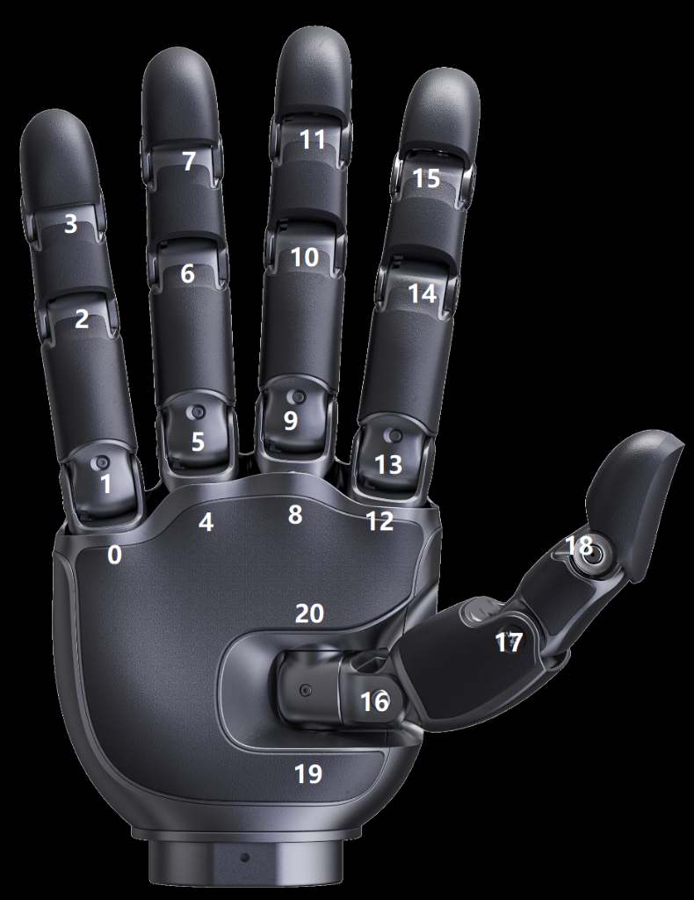
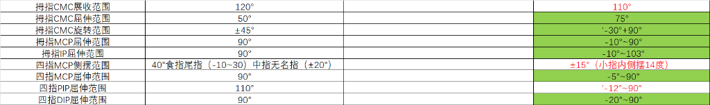
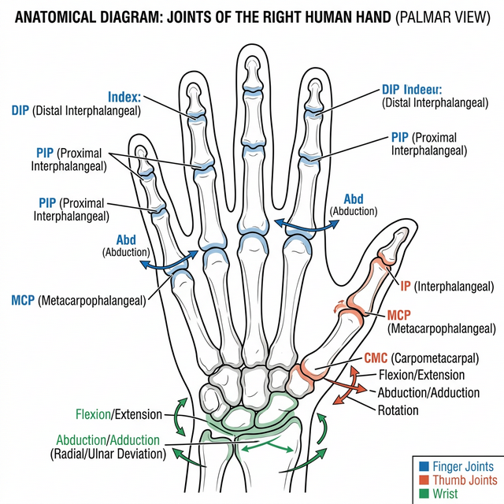

# Revo3 手部关节与电机映射

## 产品实物图（电机编号）



## 产品规格表



## 人手关节解剖参考



---

## 关节说明

### 四指 (Index / Middle / Ring / Pinky)
每根手指有 **4 个自由度**，从基部到指尖依次：

| 关节 | 全称 | 说明 |
|------|------|------|
| **Abd** | Abduction/Adduction | 侧摆 — 手指左右张开/合拢 |
| **MCP** | Metacarpophalangeal | 掌指关节 — 指根处的弯曲（握拳时主要弯的地方） |
| **PIP** | Proximal Interphalangeal | 近端指间关节 — 手指中间那个关节 |
| **DIP** | Distal Interphalangeal | 远端指间关节 — 最靠近指尖的关节 |

### 拇指 (Thumb)
拇指有 **5 个自由度**，结构与四指不同：

| 关节 | Motor ID | 范围 | 说明 |
|------|----------|------|------|
| **IP** | M18 | -10°~103° | 拇指指尖弯曲（最末端关节） |
| **MCP** | M17 | -10°~90° | 拇指第一指节弯曲（中间关节） |
| **CMC Rotation** | M16 | -30°~90° | 拇指沿长轴自转，控制指腹朝向 |
| **CMC Abduction** | M19 | 0°~110° | 拇指在手掌平面内展开/收拢（差动） |
| **CMC Flexion** | M20 | 0°~75° | 拇指垂直于手掌平面弯曲（差动） |

> **Note:**
> - M18(IP)、M17(MCP) 位于拇指指节上，从实物图可直接辨认位置
> - M16(CMC Rot) 位于拇指基部与手掌连接处
> - M19、M20 是差动电机，位于手掌内部，通过差速机构驱动 CMC 的展收和屈伸两个轴
> - CMC (Carpometacarpal) 腕掌关节是鞍状关节，3个自由度的组合使拇指能完成"对掌"动作

### 手腕 (Wrist)

| 关节 | Motor ID | 范围 | 说明 |
|------|----------|------|------|
| **Flexion/Extension** | M21 | ±60° | 手腕上下弯曲 |
| **Abduction** | M22 | ±25° | 手腕左右偏转（桡偏/尺偏） |

## 完整电机映射表

| Motor ID | 手指 | 关节 | 范围 |
|----------|------|------|------|
| M0 | Pinky | Abd | -14°~15° |
| M1 | Pinky | MCP | -5°~90° |
| M2 | Pinky | PIP | -12°~90° |
| M3 | Pinky | DIP | -20°~90° |
| M4 | Ring | Abd | ±15° |
| M5 | Ring | MCP | -5°~90° |
| M6 | Ring | PIP | -12°~90° |
| M7 | Ring | DIP | -20°~90° |
| M8 | Middle | Abd | ±15° |
| M9 | Middle | MCP | -5°~90° |
| M10 | Middle | PIP | -12°~90° |
| M11 | Middle | DIP | -20°~90° |
| M12 | Index | Abd | ±15° |
| M13 | Index | MCP | -5°~90° |
| M14 | Index | PIP | -12°~90° |
| M15 | Index | DIP | -20°~90° |
| M16 | Thumb | CMC Rot | -30°~90° |
| M17 | Thumb | MCP | -10°~90° |
| M18 | Thumb | IP | -10°~103° |
| M19 | Thumb | CMC Abd (diff) | 0°~110° |
| M20 | Thumb | CMC Flex (diff) | 0°~75° |
| M21 | Wrist | Flex/Ext | ±60° |
| M22 | Wrist | Abd | ±25° |

## REVO3_FINGER_MOTORS 映射 (代码中的数组顺序)

```python
REVO3_FINGER_MOTORS = {
    "Thumb":  [18, 17, 16, 19, 20],  # top-down: IP, MCP, CMC-Rot + diff: CMC-Abd, CMC-Flex
    "Index":  [15, 14, 13, 12],      # top-down: DIP, PIP, MCP, Abd
    "Middle": [11, 10, 9, 8],        # top-down: DIP, PIP, MCP, Abd
    "Ring":   [7, 6, 5, 4],          # top-down: DIP, PIP, MCP, Abd
    "Pinky":  [3, 2, 1, 0],          # top-down: DIP, PIP, MCP, Abd
    "Wrist":  [21, 22],              # Flex/Ext, Abd
}
```
