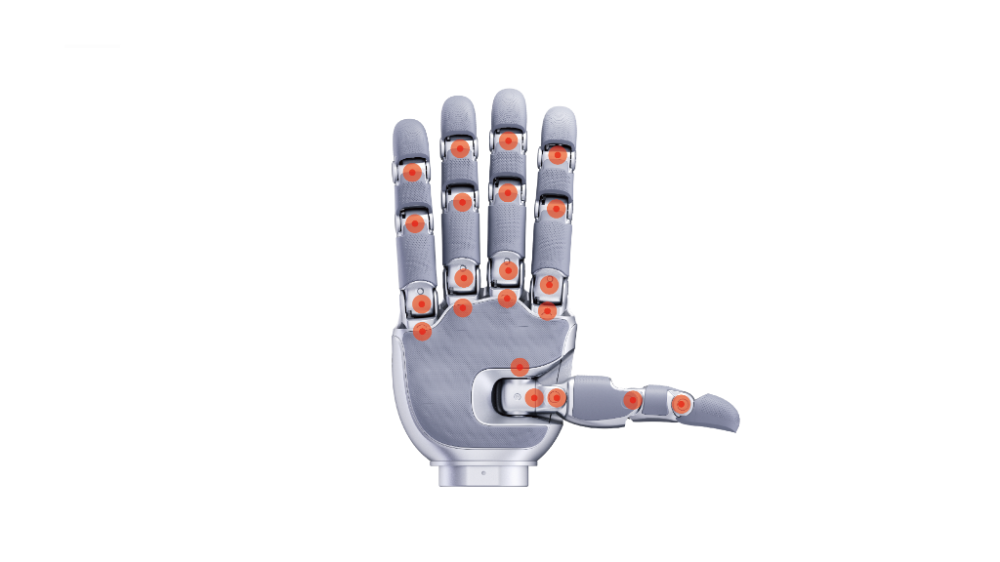
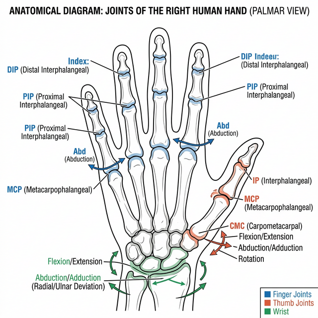

# BrainCo Revo3 灵巧手 21 关节与电机映射

本文说明 SDK 2.x 使用的 21 关节逻辑顺序、默认参考范围和底层通道映射。
设备运行时的位置限位以 `hand.config.snapshot()` 的返回值为准。

---

## 1. 产品结构与电机编号





---

## 2. 21 关节与默认参考范围

SDK 按下表顺序表示 21 个逻辑关节。表中范围是 GUI 和离线工具使用的默认参考值，
不会自动写入设备，也不代替目标设备的配置限位。

| 主动关节 | 逻辑关节序号 | 自由度名称 | 运动角度参考范围 | 运动学与解剖说明 |
| :--- | :---: | :--- | :---: | :--- |
| **小拇指 (Pinky)** | J0 | **Abd** 侧摆展收 | `-30° ~ 10°` | 小指侧摆左右偏转 |
| | J1 | **MCP** 掌指关节屈伸 | `-5° ~ 90°` | 掌指关节屈伸 |
| | J2 | **PIP** 近端指间关节屈伸 | `-10° ~ 90°` | 近端指间关节屈伸 |
| | J3 | **DIP** 远端指间关节屈伸 | `-20° ~ 90°` | 远端指间关节屈伸 |
| **无名指 (Ring)** | J4 | **Abd** 侧摆展收 | `-25° ~ 20°` | 无名指侧摆左右偏转 |
| | J5 | **MCP** 掌指关节屈伸 | `-5° ~ 90°` | 掌指关节屈伸 |
| | J6 | **PIP** 近端指间关节屈伸 | `-10° ~ 90°` | 近端指间关节屈伸 |
| | J7 | **DIP** 远端指间关节屈伸 | `-20° ~ 90°` | 远端指间关节屈伸 |
| **中指 (Middle)** | J8 | **Abd** 侧摆展收 | `-20° ~ 25°` | 中指侧摆左右偏转 |
| | J9 | **MCP** 掌指关节屈伸 | `-5° ~ 90°` | 掌指关节屈伸 |
| | J10 | **PIP** 近端指间关节屈伸 | `-10° ~ 90°` | 近端指间关节屈伸 |
| | J11 | **DIP** 远端指间关节屈伸 | `-20° ~ 90°` | 远端指间关节屈伸 |
| **食指 (Index)** | J12 | **Abd** 侧摆展收 | `-10° ~ 30°` | 食指侧摆左右张开与合拢 |
| | J13 | **MCP** 掌指关节屈伸 | `-5° ~ 90°` | 掌指关节弯曲（握拳主要动作轴） |
| | J14 | **PIP** 近端指间关节屈伸 | `-10° ~ 90°` | 手指近端中间关节弯曲 |
| | J15 | **DIP** 远端指间关节屈伸 | `-20° ~ 90°` | 手指最靠近指尖的远端关节弯曲 |
| **大拇指 (Thumb)** | J16 | **CMC Rot** 腕掌关节长轴自转对掌 | `0° ~ 105°` | 拇指沿长轴自转，控制指腹朝向与对指 (驱动通道 CH4) |
| | J17 | **MCP** 指根屈伸（规格 PIP） | `-10° ~ 90°` | 拇指第一指节屈伸（中间关节，驱动通道 CH3） |
| | J18 | **IP** 指尖屈伸（规格 DIP） | `-20° ~ 90°` | 拇指最末端指间关节屈伸 (驱动通道 CH0) |
| | J19 | **CMC Abd** 腕掌关节外展内收 | `0° ~ 110°` | 拇指在手掌平面内展开与收拢（差动，驱动通道 CH1） |
| | J20 | **CMC Flex** 腕掌关节屈伸（规格 MCP） | `0° ~ 75°` | 拇指垂直于手掌平面弯曲（差动，驱动通道 CH2） |

---

拇指 MCP、PIP、DIP 命名分别对应 SDK 的 J20（CMC Flex）、J17（MCP）、J18（IP）。

SDK 默认表只初始化本地限位缓存，设备回读值会覆盖默认值，不会自动写入设备。运行时应以 `hand.config.snapshot()` 返回的位置限位为准。

## 3. SDK 逻辑关节与映射规则

### 3.1 四指控制映射规则 (`move_finger`)
在 SDK 2.x 接口中，四指的 `finger_index` 取值范围为 `1..=4`（从食指到小指）：
- `finger_index = 1`：**食指 (Index)** ➔ 起始关节 J12（范围 J12 ~ J15）
- `finger_index = 2`：**中指 (Middle)** ➔ 起始关节 J8（范围 J8 ~ J11）
- `finger_index = 3`：**无名指 (Ring)** ➔ 起始关节 J4（范围 J4 ~ J7）
- `finger_index = 4`：**小拇指 (Pinky)** ➔ 起始关节 J0（范围 J0 ~ J3）

计算公式：`start_joint_id = (4 - finger_index) * 4`。传入非法索引（如 0 或 >4）将由 SDK 校验并阻断报错。

每根四指传入的 4 个目标位置固定遵循：`[Abd, MCP, PIP, DIP]`。

### 3.2 大拇指控制映射规则 (`move_thumb`)
大拇指拥有 5 个独立自由度，调用 `move_thumb()` 时固定传入包含 5 个浮点目标的数组，公共逻辑顺序严格为：
1. `J16`: **CMC Rotation**（自转对掌，对应底层驱动通道 `CH4`）
2. `J17`: **MCP**（指根屈伸，对应底层驱动通道 `CH3`）
3. `J18`: **IP**（指尖屈伸，对应底层驱动通道 `CH0`）
4. `J19`: **CMC Abduction**（外展内收，对应底层驱动通道 `CH1`）
5. `J20`: **CMC Flexion**（腕掌屈伸，对应底层驱动通道 `CH2`）

底层硬件驱动通道映射关系：
```rust
match thumb_logical_joint {
    0 => 4, // J16 Rotation -> CH4
    1 => 3, // J17 MCP      -> CH3
    2 => 0, // J18 IP       -> CH0
    3 => 1, // J19 CMC Abd  -> CH1
    4 => 2, // J20 CMC Flex -> CH2
}
```

---

## 4. 通信拓扑与默认设备 ID

- **默认从机 ID (Slave ID)**：
  - 默认左手 ID：`126`
  - 默认右手 ID：`127`
  - 广播控制 ID：`0`（向 ID 0 发送命令将同步控制总线上所有设备）
- **开机自校准安全须知**：
  - 灵巧手上电后将自动执行一次手指零位自校准，在此期间五指将全部张开；
  - **安全警告**：若上电时灵巧手正抓握物体，自校准会导致物体脱落，请务必在空载状态下上电启动。
