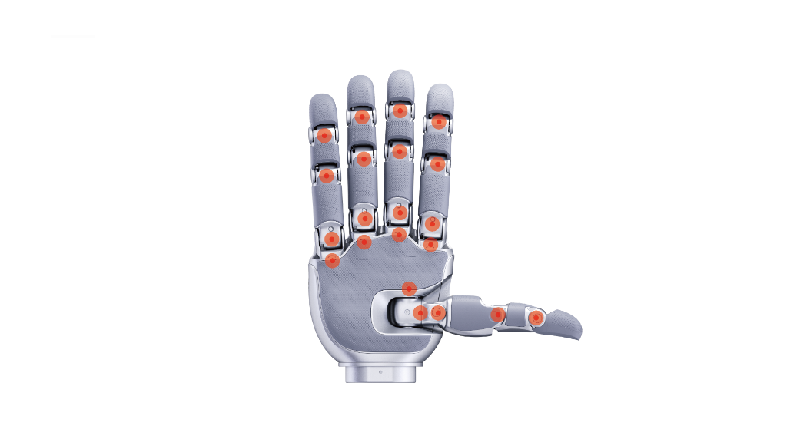

# BrainCo Revo3 灵巧手 21 关节与电机映射

本文说明 SDK 2.x 使用的 21 关节逻辑编号和角度参考范围。

---

## 1. 产品结构与电机编号

---

## 2. 21 关节与角度参考范围

SDK 按下表顺序表示 21 个逻辑关节，角度为参考范围。

| 主动关节 | 逻辑关节序号 | 自由度名称 | 运动角度参考范围 | 动作说明 |
| :--- | :---: | :--- | :---: | :--- |
| **小拇指 (Pinky)** | J0 | **Abd** 侧摆展收 | `-30° ~ 10°` | 小指侧摆左右偏转 |
| | J1 | **MCP** 掌指关节屈伸 | `-5° ~ 90°` | 掌指关节屈伸 |
| | J2 | **PIP** 近端指间关节屈伸 | `-10° ~ 90°` | 近端指间关节屈伸 |
| | J3 | **DIP** 远端指间关节屈伸 | `-20° ~ 90°` | 远端指间关节屈伸 |
| **无名指 (Ring)** | J4 | **Abd** 侧摆展收 | `-25° ~ 20°` | 无名指侧摆左右偏转 |
| | J5 | **MCP** 掌指关节屈伸 | `-5° ~ 90°` | 掌指关节屈伸 |
| | J6 | **PIP** 近端指间关节屈伸 | `-10° ~ 90°` | 近端指间关节屈伸 |
| | J7 | **DIP** 远端指间关节屈伸 | `-20° ~ 90°` | 远端指间关节屈伸 |
| **中指 (Middle)** | J8 | **Abd** 侧摆展收 | `-20° ~ 25°` | 中指侧摆左右偏转 |
| | J9 | **MCP** 掌指关节屈伸 | `-5° ~ 90°` | 掌指关节屈伸 |
| | J10 | **PIP** 近端指间关节屈伸 | `-10° ~ 90°` | 近端指间关节屈伸 |
| | J11 | **DIP** 远端指间关节屈伸 | `-20° ~ 90°` | 远端指间关节屈伸 |
| **食指 (Index)** | J12 | **Abd** 侧摆展收 | `-10° ~ 30°` | 食指侧摆左右张开与合拢 |
| | J13 | **MCP** 掌指关节屈伸 | `-5° ~ 90°` | 掌指关节弯曲（握拳主要动作轴） |
| | J14 | **PIP** 近端指间关节屈伸 | `-10° ~ 90°` | 手指近端中间关节弯曲 |
| | J15 | **DIP** 远端指间关节屈伸 | `-20° ~ 90°` | 手指最靠近指尖的远端关节弯曲 |
| **大拇指 (Thumb)** | J16 | **CMC Flex** 拇指根部屈伸 | `0° ~ 75°` | 拇指朝掌内弯曲 |
| | J17 | **MCP** 拇指中间关节屈伸 | `-10° ~ 90°` | 拇指中间关节弯曲与伸展 |
| | J18 | **IP** 拇指末端关节屈伸 | `-20° ~ 90°` | 拇指末端关节弯曲与伸展 |
| | J19 | **CMC Abd** 拇指外展内收 | `0° ~ 110°` | 拇指外展与内收 |
| | J20 | **CMC Rotation** 拇指自转对掌 | `0° ~ 105°` | 拇指自转，改变指腹朝向 |

控制与反馈按 J 编号排列，运行限位以 `hand.config.snapshot()` 的设备回读值为准。

## 3. SDK 逻辑关节与映射规则

### 3.1 四指控制映射规则 (`move_finger`)
在 SDK 2.x 接口中，四指的 `finger_index` 取值范围为 `1..=4`（从食指到小指）：

- `finger_index = 1`：**食指 (Index)** ➔ 起始关节 J12（范围 J12 ~ J15）
- `finger_index = 2`：**中指 (Middle)** ➔ 起始关节 J8（范围 J8 ~ J11）
- `finger_index = 3`：**无名指 (Ring)** ➔ 起始关节 J4（范围 J4 ~ J7）
- `finger_index = 4`：**小拇指 (Pinky)** ➔ 起始关节 J0（范围 J0 ~ J3）

计算公式：`start_joint_id = (4 - finger_index) * 4`。传入非法索引（如 0 或 >4）将由 SDK 校验并阻断报错。

每根四指传入的 4 个目标位置固定遵循：`[Abd, MCP, PIP, DIP]`。

### 3.2 大拇指关节编号

拇指的 5 个逻辑关节按 `[J16, J17, J18, J19, J20]` 排列。
`move_thumb()` 接受按上述编号顺序排列的 5 个目标角度。

调用 SDK 时使用逻辑关节编号或 API 规定的数组顺序，由 SDK 处理底层协议映射。

---

## 4. 通信拓扑与默认设备 ID

- **默认从机 ID (Slave ID)**：
  - 默认左手 ID：`126`
  - 默认右手 ID：`127`
  - 广播控制 ID：`0`（向 ID 0 发送命令将同步控制总线上所有设备）
- **开机自校准安全须知**：
  - 启用上电自动校准时，灵巧手上电后会执行零位校准，手指可能运动；
  - **安全警告**：若上电时灵巧手正抓握物体，自校准会导致物体脱落，请务必在空载状态下上电启动。
