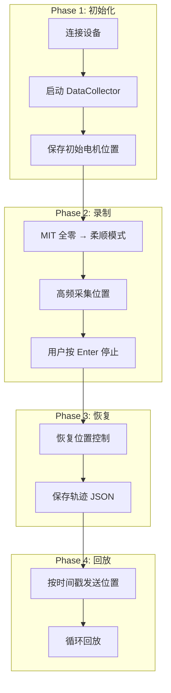
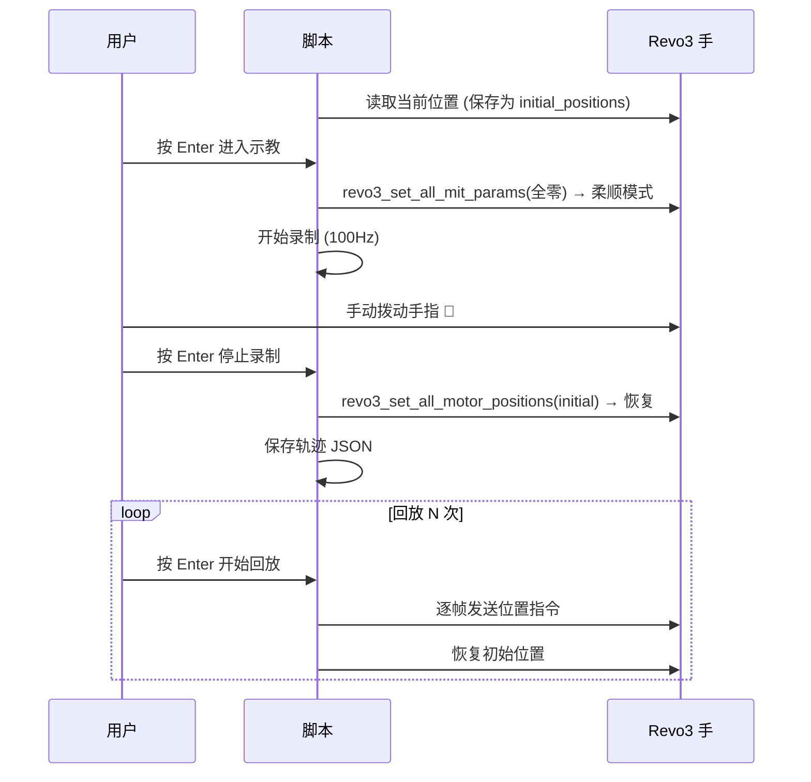

# Revo3 示教模式 Demo 代码详解

> 文件: [revo3_teaching.py](revo3_teaching.py)

---

## 整体架构



---

## 1. Trajectory 类 — 轨迹数据结构

```python
class Trajectory:
    def __init__(self):
        self.frames = []       # [(时间戳, [23个电机位置]), ...]
        self.start_time = None
```

### 核心思想
每一帧 = `(相对时间, 23个电机角度)`。用**相对时间戳**而不是绝对时间，方便变速回放。

### `add_frame(positions)`
```python
def add_frame(self, positions):
    now = time.perf_counter()
    if self.start_time is None:
        self.start_time = now          # 第一帧 → 记录起始时间
    relative_t = now - self.start_time  # 相对于起始的秒数
    self.frames.append((relative_t, list(positions)))
```
- `time.perf_counter()`: 高精度计时器（微秒级）
- 第一帧 t=0.0，后续帧 t=0.01, 0.02, ...
- `list(positions)`: **拷贝**位置数组，避免引用被后续覆盖

### `save(filepath)` / `load(filepath)`

JSON 格式存储，人类可读：
```json
{
  "motor_count": 23,
  "frame_count": 500,
  "duration_sec": 5.0,
  "frames": [
    {"t": 0.0000, "pos": [0.0, 1.2, ...]},
    {"t": 0.0100, "pos": [0.5, 1.8, ...]},
  ]
}
```
- `round(t, 4)`: 时间保留 4 位小数（0.1ms 精度）
- `round(p, 2)`: 角度保留 2 位小数（0.01° 精度）

### `summary()`
打印轨迹统计，包括每个手指各电机的角度范围：
```
  Frames: 500
  Duration: 5.00s
  Avg frequency: 100.0 Hz
  Pinky : M0:[-5°,15°], M1:[0°,90°], M2:[0°,85°], M3:[0°,80°]
  Index : M12:[-2°,10°], M13:[0°,45°], ...
```

---

## 2. 零力矩模式 — 核心原理

### `enter_teaching_mode()`

```python
async def enter_teaching_mode(client, slave_id):
    zeros = [0.0] * REVO3_MOTOR_COUNT   # 23 个 0
    await client.revo3_set_all_mit_params(
        slave_id,
        zeros,   # kp          → Kp    = 0
        zeros,   # kd          → Kd    = 0
        zeros,   # positions   → P_des = 0
        zeros,   # velocities  → V_des = 0
        zeros,   # currents    → T_ff  = 0
    )
```

> [!IMPORTANT]
> **MIT 公式**: `tau = Kp×(P_des - P_act) + Kd×(V_des - V_act) + T_ff`
>
> 当 **Kp=0, Kd=0, T_ff=0** 时：
> - `Kp×(0 - P_act) = 0`（无位置恢复力）
> - `Kd×(0 - V_act) = 0`（无速度阻尼）
> - `T_ff = 0`（无前馈力矩）
>
> → 电机输出力矩 tau ≈ 0，**手变成完全柔顺状态**，可以自由拨动

这一条命令写入 **115 个 Modbus 寄存器**（23×5 参数），一次性让所有电机失力。

### `exit_teaching_mode()`

```python
async def exit_teaching_mode(client, slave_id, restore_positions=None):
    if restore_positions is not None:
        await client.revo3_set_all_motor_positions(slave_id, restore_positions)
    else:
        await client.revo3_set_all_motor_positions(slave_id, [0.0] * REVO3_MOTOR_COUNT)
```

从 MIT 模式切回**位置控制模式** — SDK 内部会自动切换控制模式。恢复到进入示教前保存的位置。

---

## 3. 录制流程

### `record_trajectory()`

```python
async def record_trajectory(client, slave_id, motor_buffer, record_freq):
    trajectory = Trajectory()
    interval = 1.0 / record_freq   # 例如 100Hz → 0.01s

    while True:
        loop_start = time.perf_counter()

        # 从 DataCollector 的 ring buffer 读取最新位置
        latest = motor_buffer.peek_latest()
        if latest and hasattr(latest, 'positions'):
            trajectory.add_frame(list(latest.positions))

        # 控制采样频率
        elapsed_loop = time.perf_counter() - loop_start
        sleep_time = interval - elapsed_loop
        if sleep_time > 0:
            await asyncio.sleep(sleep_time)
```

**关键设计**：

| 组件 | 频率 | 作用 |
|------|------|------|
| **DataCollector** | 200Hz (macOS) | 后台线程持续轮询 Modbus，填充 ring buffer |
| **record loop** | 100Hz (默认) | 从 buffer 中 peek 最新数据，打时间戳存入 Trajectory |

- `peek_latest()`: 非阻塞，只读取最新一帧，不清空 buffer
- 录制频率可通过 `--freq` 参数调整（50~200Hz 都合理）
- 每 2 秒打印一次进度：帧数、实际频率、前 5 个电机位置

### 录制的启动与停止

```python
# 启动：创建异步任务
record_task = asyncio.create_task(
    record_trajectory(client, slave_id, motor_buffer, record_freq)
)

# 等待用户按 Enter
await wait_for_key_or_enter("Press Enter to stop recording...")

# 停止：取消任务
record_task.cancel()
trajectory = await record_task   # record_trajectory 内部捕获 CancelledError 后返回
```

用 `asyncio.create_task` + `cancel()` 实现非阻塞录制 + 随时停止。

---

## 4. 回放流程

### `playback_trajectory()`

```python
for i, (target_t, positions) in enumerate(trajectory.frames):
    adjusted_t = target_t / speed      # 变速：speed=2.0 → 时间减半

    # 精确等待到目标时刻
    while True:
        elapsed = time.perf_counter() - playback_start
        if elapsed >= adjusted_t:
            break
        await asyncio.sleep(min(remaining, 0.001))  # 1ms 精度

    # 发送位置指令
    await client.revo3_set_all_motor_positions(slave_id, positions)
```

**变速原理**：
- `speed = 1.0` → 实时回放
- `speed = 0.5` → 每帧时间 ×2 → 慢放
- `speed = 2.0` → 每帧时间 ÷2 → 加速

每帧发 `revo3_set_all_motor_positions`（23 个寄存器），电机固件会自动平滑插值到目标位置。

---

## 5. 交互流程 (`interactive_session`)



---

## 6. 安全机制

### finally 块

```python
finally:
    if collector:
        collector.stop()
        collector.wait()
    if client:
        try:
            await client.revo3_set_all_motor_positions(1, [0.0] * REVO3_MOTOR_COUNT)
        except Exception:
            pass
        libstark.modbus_close(client)
```

无论程序如何退出（正常结束、Ctrl+C、异常），都会：
1. 停止 DataCollector 后台线程
2. **尝试恢复位置控制**（防止手一直处于零力矩状态）
3. 关闭 Modbus 连接

### 自动保存

```python
if save_path:
    trajectory.save(save_path)
elif trajectory.frame_count > 0:
    auto_path = f"trajectory_{int(time.time())}.json"
    trajectory.save(auto_path)
```

即使用户没指定 `--save`，也会自动保存为 `trajectory_1743658800.json`，避免辛苦录制的数据丢失。

---

## 7. 命令行参数总结

| 参数 | 默认值 | 说明 |
|------|--------|------|
| `--port` | 自动检测 | 串口名称 |
| `--freq` | 100 | 录制频率 (Hz) |
| `--save` | 自动命名 | 保存轨迹文件路径 |
| `--load` | 无 | 加载轨迹（跳过录制） |
| `--speed` | 1.0 | 回放速度倍率 |
| `--loop` | 1 | 回放循环次数 |
